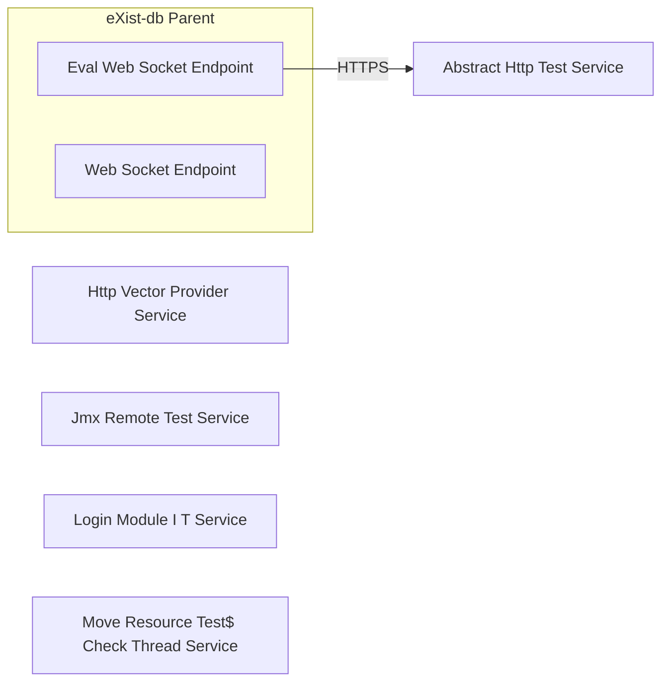

# Architecture

## System Diagram

## Components

### Services

- **EvalWebSocketEndpoint**: WEBSOCKET /ws/eval, WEBSOCKET onMessage
- **WebSocketEndpoint**: WEBSOCKET /ws, WEBSOCKET /ws

### External Services

- **Abstract Http Test Service**: HTTPS service
- **Http Vector Provider Service**: HTTPS service
- **Jmx Remote Test Service**: HTTPS service
- **Login Module I T Service**: HTTPS service
- **Move Resource Test$ Check Thread Service**: HTTPS service

## Reference

For the complete CALM (Common Architecture Language Model) schema, see [calm-architecture.json](calm-architecture.json).
