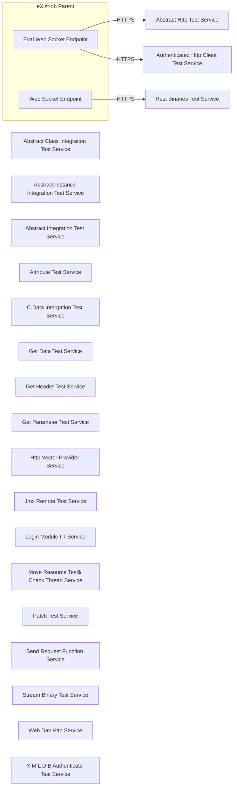

# Architecture

## System Diagram

## Components

### Services

- **EvalWebSocketEndpoint**: WEBSOCKET /ws/eval, WEBSOCKET onMessage
- **WebSocketEndpoint**: WEBSOCKET /ws, WEBSOCKET /ws

### External Services

- **Abstract Class Integration Test Service**: HTTPS service
- **Abstract Http Test Service**: HTTPS service
- **Abstract Instance Integration Test Service**: HTTPS service
- **Abstract Integration Test Service**: HTTPS service
- **Attribute Test Service**: HTTPS service
- **Authenticated Http Client Test Service**: HTTPS service
- **C Data Intergation Test Service**: HTTPS service
- **Get Data Test Service**: HTTPS service
- **Get Header Test Service**: HTTPS service
- **Get Parameter Test Service**: HTTPS service
- **Http Vector Provider Service**: HTTPS service
- **Jmx Remote Test Service**: HTTPS service
- **Login Module I T Service**: HTTPS service
- **Move Resource Test$ Check Thread Service**: HTTPS service
- **Patch Test Service**: HTTPS service
- **Rest Binaries Test Service**: HTTPS service
- **Send Request Function Service**: HTTPS service
- **Stream Binary Test Service**: HTTPS service
- **Web Dav Http Service**: HTTPS service
- **X M L D B Authenticate Test Service**: HTTPS service

## Reference

For the complete CALM (Common Architecture Language Model) schema, see [calm-architecture.json](calm-architecture.json).
