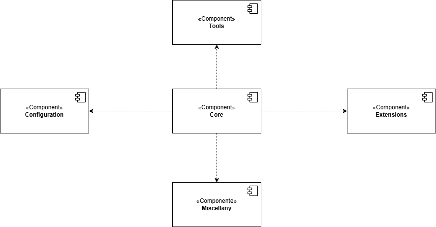
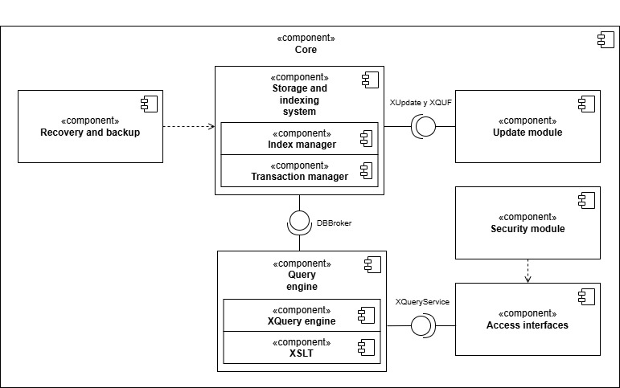

# Documentation

Here are some diagrams for a better understanding of the project

They are done in UML language.

## Context Diagram

</img>

## Use Case Diagram

</img>

## Components Diagram

</img>

### A component diagram of the core

</img>
