# eXist-db - Base de Datos Nativa XML

<div align="center">
    <a href="https://exist-db.org/" target="_blank">
        
    </a>
</div>

[](https://github.com/eXist-db/exist/actions/workflows/ci-test.yml)
[](https://coveralls.io/github/eXist-db/exist?branch=develop)
[](https://www.codacy.com/gh/eXist-db/exist/dashboard)
[](https://sonarcloud.io/dashboard?id=eXist-db_exist)
[](https://www.oracle.com/java/)
[](https://www.gnu.org/licenses/old-licenses/lgpl-2.1.html)
[](https://github.com/eXist-db/exist/releases/latest)

## 🚀 Introducción

eXist-db es una base de datos nativa XML de código abierto que permite almacenar, consultar y manipular datos XML de manera eficiente. Es utilizada en aplicaciones web, gestión documental y proyectos de digitalización de datos estructurados.

## 🏆 Características principales
- Soporte completo para XQuery y XPath.
- Indexación avanzada para consultas rápidas y eficientes.
- API REST y WebDAV para integración con otras aplicaciones.
- Alta escalabilidad y rendimiento optimizado.

## 🏗️ Arquitectura

eXist-db sigue un modelo de base de datos orientado a documentos XML con una arquitectura modular basada en los siguientes componentes:

```plantuml
@startuml
node "Cliente" {
  [Aplicación Web]
  [API REST]
  [Interfaz Web]
}

node "Servidor eXist-db" {
  [Motor XML]
  [Manejador de Índices]
  [Repositorio de Datos]
}

node "Almacenamiento" {
  [Sistema de Archivos]
  [Base de Datos]
}

[Aplicación Web] --> [API REST]
[API REST] --> [Motor XML]
[Motor XML] --> [Manejador de Índices]
[Manejador de Índices] --> [Repositorio de Datos]
[Repositorio de Datos] --> [Sistema de Archivos]
@enduml
```



## 🏁 Instalación rápida
```sh
# Descargar la última versión estable
wget https://github.com/eXist-db/exist/releases/latest/download/exist-installer.jar

# Instalar eXist-db
java -jar exist-installer.jar
```

## 📢 Casos de Uso
- Acceder a documentos XML mediante URL.
- Ejecutar consultas XQuery avanzadas.
- Gestionar colecciones y recursos.
- Integrar con aplicaciones web mediante REST.

## 🛠 Contribuir
1. Haz un fork del repositorio.
2. Clona el proyecto localmente:
   ```sh
   git clone https://github.com/tu_usuario/exist.git
   ```
3. Crea una nueva rama:
   ```sh
   git checkout -b mi-contribucion
   ```
4. Realiza los cambios y súbelos a tu repositorio.
5. Envía un Pull Request.

## 🔗 Recursos
- [Página oficial](https://exist-db.org)
- [Documentación](https://exist-db.org/exist/apps/doc)
- [Repositorio GitHub](https://github.com/eXist-db/exist)
- [Foro de la comunidad](https://exist-db.org/exist/apps/forum)
- [Canal de Slack](https://exist-db.slack.com)

## 🎉 Agradecimientos
- YourKit Java Profiler para análisis de rendimiento.
- Plataforma de pruebas proporcionada por Sauce Labs.

---
¡Gracias por usar eXist-db! 🚀
